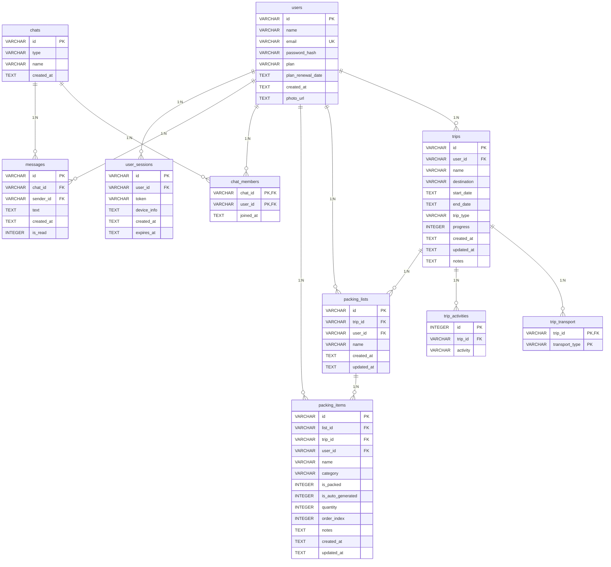

# TravelReady! - Esquema de Base de Datos SQLite

## Diagrama ER (Entity-Relationship)

## Descripcion de Tablas

| Tabla | Descripcion |
|-------|-------------|
| **users** | Usuarios registrados (email/password o Google). Plan free/premium. |
| **trips** | Viajes creados por cada usuario. Fechas, destino, progreso. |
| **trip_transport** | Transportes asociados a un viaje (relacion N:M). |
| **trip_activities** | Actividades planificadas para un viaje. |
| **packing_lists** | Listas de equipaje asociadas a un viaje. |
| **packing_items** | Items individuales dentro de una lista de equipaje. |
| **chats** | Conversaciones (soporte, IA, grupo). |
| **chat_members** | Miembros de cada chat (relacion N:M). |
| **messages** | Mensajes dentro de un chat. |
| **user_sessions** | Sesiones activas para seguridad. |

## Indices

- `idx_users_email` en users(email)
- `idx_trips_user_id` en trips(user_id)
- `idx_trips_dates` en trips(start_date, end_date)
- `idx_activities_trip` en trip_activities(trip_id)
- `idx_lists_trip` en packing_lists(trip_id)
- `idx_items_list` en packing_items(list_id)
- `idx_items_category` en packing_items(category)
- `idx_messages_chat` en messages(chat_id)
- `idx_sessions_token` en user_sessions(token)

## Triggers

- `update_trips_timestamp` - Actualiza updated_at en trips
- `update_lists_timestamp` - Actualiza updated_at en packing_lists
- `update_items_timestamp` - Actualiza updated_at en packing_items
